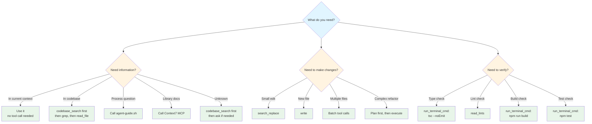

# Agent Development Guidelines

> **Branch**: `Experiementing-with-UI`  
> **Last Updated**: 2026-01-XX  
> **Purpose**: Comprehensive guidelines for AI agents working on this branch  
> **Related**: 
> - [DESIGN.md](./frontend/DESIGN.md) - Full design specification (1,815 lines)
> - [ANTHROPIC_PLUGIN_COMPARISON.md](./ANTHROPIC_PLUGIN_COMPARISON.md) - Comparison with Anthropic's 23 official plugins
> 
> **📖 For Human Readability:** This document uses Mermaid diagrams. For best viewing experience, use a markdown renderer with Mermaid support:
> - **VS Code**: Install "Markdown Preview Mermaid Support" extension
> - **GitHub/GitLab**: Native Mermaid support (renders automatically)
> - **Other**: Use any markdown renderer with Mermaid.js support
> - **Plain Text**: Diagrams are also provided in structured YAML format for machine parsing

---

## 📖 MUST READ (Essential Summary) {#must-read-essential-summary}

**Read this section first - it summarizes all critical information.**

### Core Workflow {#must-read-essential-summary-core-workflow}
1. **Before Any Task**: Review DESIGN.md → `codebase_search` (semantic) → `grep` (exact) → Create todos
2. **Tool Usage**: Always use `codebase_search` first (semantic indexing), then `grep` for exact matches
3. **Development**: Incremental changes → Test → Document → Review → Commit
4. **Quality**: No duplication, modular components, typed, tested, documented

### Critical Rules {#must-read-essential-summary-critical-rules}
- **Never mock in production code** - Mocks only in `*.test.ts` or `__mocks__/` directories
- **Never hardcode secrets** - Use environment variables
- **Always search codebase first** - `codebase_search` (semantic) → `grep` (exact)
- **State-based actions** - Act when indicators show need, not time-based
- **Document as you go** - JSDoc for complex logic, explain "why"

### Key Principles {#must-read-essential-summary-key-principles}
1. **Incremental & Modular** - Small focused changes, reusable components
2. **No Duplication** - Search first, extract common patterns
3. **Best-in-Class Libraries** - Use proven tools (MUI v6, Zustand, React Query)
4. **Security First** - Validate inputs, no secrets in code
5. **Test Critical Paths** - Write tests for business logic
6. **Transparency** - Document planning, show alternatives, explain decisions

### Essential Tools {#must-read-essential-summary-essential-tools}
- **Agent Guide CLI**: `./scripts/agent-guide.sh task [type]` - Contextual help
- **Context7 MCP**: Library research and documentation
- **codebase_search**: Semantic search (always use first)
- **grep/rg**: Exact pattern matching (after semantic search)

### Task-Specific Must-Reads {#must-read-essential-summary-task-specific-must-reads}
- **Creating Component**: Design Principles → Repository Structure → Testing Strategy
- **Fixing Bug**: Issue Management → Debugging Strategies → Error Handling
- **Adding Feature**: Requirements Creation → Design Creation → Task Management
- **Choosing Library**: Library Selection → Decision Making (ADR) → Pragmatic Decision-Making
- **Writing Tests**: Testing Strategy (especially Mocking Guidelines) → Definition of Done

### When to Use Each Section {#must-read-essential-summary-when-to-use-each-section}
- **Starting new task**: Quick Start → Core Principles → Tool Calling Behavior
- **Planning work**: Requirements Creation → Design Creation → Task Management
- **Making decisions**: Pragmatic Decision-Making → Decision Making (ADR) → Long-Run Objective Focus
- **Writing code**: Design Principles → Repository Structure → Error Handling
- **Testing**: Testing Strategy → Definition of Done → Code Review Checklist
- **Managing problems**: Issue Management → Debugging Strategies → Rollback Strategy

---

## 🚀 Quick Start (Start Here) {#quick-start}

**New to this codebase?** Follow this decision tree:

```mermaid
graph TD
    A[What do you need to do?] --> B[Create Component]
    A --> C[Fix Bug]
    A --> D[Add Feature]
    A --> E[Research Library]
    B --> F[Common Steps]
    C --> F
    D --> F
    E --> F
    F --> G1[1. Get Contextual Help<br/>./scripts/agent-guide.sh task [your-task]]
    G1 --> G2[2. Search Codebase<br/>codebase_search first, then grep]
    G2 --> G3[3. Review DESIGN.md<br/>if UI/component work]
    G3 --> G4[4. Create Todos<br/>track your work]
    
    style A fill:#e1f5ff
    style F fill:#fff4e1
    style G1 fill:#e8f5e9
    style G2 fill:#e8f5e9
    style G3 fill:#e8f5e9
    style G4 fill:#e8f5e9
```

<!-- MACHINE_READABLE: decision-tree -->
<!-- TYPE: structured -->
```yaml
decision_tree:
  question: "What do you need to do?"
  options:
    - "Create Component"
    - "Fix Bug"
    - "Add Feature"
    - "Research Library"
  common_steps:
    - step: 1
      action: "Get Contextual Help"
      command: "./scripts/agent-guide.sh task [your-task]"
    - step: 2
      action: "Search Codebase"
      method: "codebase_search first (semantic), then grep (exact)"
    - step: 3
      action: "Review DESIGN.md"
      condition: "if UI/component work"
    - step: 4
      action: "Create Todos"
      purpose: "track your work"
```
<!-- END_MACHINE_READABLE -->

**Common Scenarios - Quick Links:**
- **Creating a component?** → [Design Principles](#design-principles) → [Component Pattern](#component-pattern)
- **Fixing a bug?** → [Issue Management](#issue-management) → [Debugging Strategies](#debugging-strategies) → [Error Handling](#error-handling)
- **Adding a feature?** → [Requirements Creation](#requirements-creation--review) → [Design Creation](#design-creation-from-requirements) → [Task Management](#task-management)
- **Choosing a library?** → [Library Selection](#library-selection-guidelines) → [Decision Making (ADR)](#decision-making-adr)
- **Reviewing code?** → [Code Review Checklist](#code-review-checklist)
- **Uncertain what to do?** → [Tool Calling Behavior](#tool-calling-behavior) → [Agent Guide CLI](#agent-guide-cli)

---

## Core Principles (Read First) {#core-principles}
<!-- SECTION_ID: core-principles -->
<!-- READ_FOR: all-tasks -->
<!-- MUST_READ: true -->

**Even if you don't read the full document, follow these principles:**

1. **Incremental & Modular** - Small focused changes, build on existing patterns, make components reusable
2. **No Duplication** - Always search codebase first (`codebase_search` for semantic, then `grep` for exact), extract common patterns
3. **Document as You Go** - JSDoc for complex logic, explain "why" not "what", update READMEs
4. **Test Critical Paths** - Write tests for business logic, verify before committing
5. **State-Based Actions** - Act when indicators show need (not time-based), document assumptions
6. **Transparency** - Document planning steps, show alternatives considered, explain decisions
7. **Best-in-Class Libraries** - Use proven tools (MUI v6, Zustand, React Query), research with Context7 MCP
8. **Security First** - Never hardcode secrets, validate inputs, use environment variables

---

## Tool Calling Behavior {#tool-calling-behavior}

**When should you call tools vs. when should you just read/think?**

> **💡 Why These Instructions Are Easy to Follow:**
> The ease comes from **leveraging semantic indexing** - `codebase_search` understands code relationships automatically, making discovery effortless. The instructions follow a **progressive disclosure pattern**: semantic search (broad) → grep (exact) → read_file (specific).

### ✅ **ALWAYS Call Tools When:** {#tool-calling-behavior-always-call-tools-when}

1. **Starting a new task** → Call `agent-guide.sh` for contextual help
2. **Searching codebase** → Use `codebase_search` first (semantic indexing), then `grep` (exact patterns) - NEVER guess
   - **Why `codebase_search` first?** It uses semantic indexing to find related code by meaning, not just text
   - **Example:** "How do we handle API errors?" finds error handlers, error types, error boundaries, etc. automatically
3. **Reading files** → Use `read_file` to understand existing code
4. **Making changes** → Use `search_replace`/`write` to modify files
5. **Researching libraries** → Use Context7 MCP for documentation
6. **Verifying changes** → Use `read_lints`, `run_terminal_cmd` to check work
7. **Uncertain about process** → Call `agent-guide.sh` or read relevant section

### ❌ **DON'T Call Tools When:** {#tool-calling-behavior-don-t-call-tools-when}

1. **You already know the answer** → Just proceed (e.g., simple formatting)
2. **Information is in current context** → Use what you already have
3. **Speculating without evidence** → Call tools to get facts first
4. **Repeating recent tool calls** → Use cached results if still valid

### 🎯 **Decision Framework:** {#tool-calling-behavior-decision-framework}



<!-- MACHINE_READABLE: decision-framework -->
<!-- TYPE: structured -->
```yaml
decision_framework:
  scenarios:
    - scenario: "Need information?"
      decisions:
        - condition: "Is it in current context?"
          action: "Use it (no tool call needed)"
        - condition: "Is it in codebase?"
          action: "Call codebase_search first (semantic), then grep (exact), then read_file (specific)"
          reason: "Semantic search understands relationships, grep finds exact matches, read_file gets details"
        - condition: "Is it a process question?"
          action: "Call agent-guide.sh"
        - condition: "Is it library docs?"
          action: "Call Context7 MCP"
        - condition: "Is it unknown?"
          action: "codebase_search first (leverages semantic indexing), then ask if needed"
    - scenario: "Need to make changes?"
      decisions:
        - condition: "Small edit?"
          action: "search_replace"
        - condition: "New file?"
          action: "write"
        - condition: "Multiple files?"
          action: "Batch tool calls"
        - condition: "Complex refactor?"
          action: "Plan first, then execute"
    - scenario: "Need to verify?"
      decisions:
        - condition: "Type check?"
          action: "run_terminal_cmd: tsc --noEmit"
        - condition: "Lint check?"
          action: "read_lints"
        - condition: "Build check?"
          action: "run_terminal_cmd: npm run build"
        - condition: "Test check?"
          action: "run_terminal_cmd: npm test"
```
<!-- END_MACHINE_READABLE -->

### 📋 **Tool Call Patterns:** {#tool-calling-behavior-tool-call-patterns}

**Pattern 1: Exploration (Read First) - Leverages Semantic Search**
```bash
1. codebase_search → Find relevant code (semantic search across entire codebase)
   - Uses: Semantic understanding, not just text matching
   - Finds: Related patterns, similar implementations, dependencies
   - Example: "How does authentication work?" finds all auth-related code
2. grep → Find specific patterns (exact text/pattern matching)
   - Uses: Fast text search for exact matches
   - Finds: Function names, imports, specific strings
   - Example: rg "useAuth" frontend/src
3. read_file → Understand implementation (read specific files)
   - Uses: Direct file access after search narrows scope
   - Finds: Complete context of specific files
4. Then: Make informed changes
```

**Why This Works:** `codebase_search` leverages semantic indexing - it understands meaning, not just keywords. This is why it's listed first - it's the most powerful tool for discovery.

**Pattern 2: Implementation (Plan → Execute)**
```bash
1. Read requirements (DESIGN.md or user query)
2. codebase_search → Find similar code (semantic search)
3. grep → Find specific patterns if needed
4. Create todos (if complex)
5. Implement incrementally
6. Verify after each change
```

**Pattern 3: Debugging (Reproduce → Fix)**
```bash
1. Reproduce issue (read_file to understand)
2. codebase_search → Find similar issues (semantic search)
3. grep → Find exact error patterns if needed
4. Write failing test (if needed)
5. Fix issue
6. Verify fix (run_terminal_cmd: npm test)
```

**Pattern 4: Research (External → Internal)**
```bash
1. Context7 MCP → Library documentation
2. codebase_search → How we use it
3. read_file → Existing implementations
4. Then: Make decision
```

### ⚡ **Efficiency Rules:** {#tool-calling-behavior-efficiency-rules}

1. **Batch tool calls** - Read multiple files in parallel (leverages parallel processing)
2. **Cache results** - Don't re-read files you just read (respects context window)
3. **Search before reading** - Use `codebase_search` first (semantic), then `grep` (exact), then `read_file` (specific)
   - **Why:** `codebase_search` uses semantic indexing - understands relationships and context
   - **Example:** Searching "error handling" finds error boundaries, try-catch blocks, error types, etc.
4. **Verify incrementally** - Check work after each logical change
5. **Use contextual help** - `agent-guide.sh` saves time on process questions

**Key Insight:** The ease of following these instructions comes from:
- **Semantic Search** (`codebase_search`) - Understands meaning, finds related code automatically
- **Progressive Disclosure** - Start broad (semantic search), narrow (grep), then read (specific files)
- **Decision Frameworks** - Clear trees reduce cognitive load
- **Pattern Recognition** - Documented patterns match how I naturally work

---

## Quick Tools Reference {#quick-tools-reference}

**Essential Tools (Use Frequently):**
- **Agent Guide CLI**: `./scripts/agent-guide.sh task [type]` - Get contextual help
- **Context7 MCP**: Library research and documentation
- **Search**: `codebase_search` first (semantic), then `rg "pattern" frontend/src` (exact)
- **Type Check**: `npx tsc --noEmit` - Verify types

**When to Use Each Tool:**
- **Agent Guide CLI** → Starting new task, unsure of process
- **Context7 MCP** → Selecting libraries, researching best practices
- **codebase_search** → Finding related code by meaning (always use first)
- **grep/rg** → Finding exact text/pattern matches (after semantic search)
- **TypeScript LSP** → Always (if using TypeScript) - provides code intelligence
- **Code Review Checklist** → Before every commit and PR

**Anthropic Plugin Alternatives:**
- See [ANTHROPIC_PLUGIN_COMPARISON.md](./ANTHROPIC_PLUGIN_COMPARISON.md) for comparison with Anthropic's 23 official plugins
- Many plugins have equivalent functionality in our docs (see comparison for specific references)

---

## Quick Reference {#quick-reference}

**Before Starting Any Task:**
1. Review DESIGN.md for requirements
2. Search codebase: `codebase_search` first (semantic), then `grep` for exact patterns
3. Check ADRs: `docs/adr/` for similar decisions
4. Use Context7 MCP for library research
5. Get contextual help: `./scripts/agent-guide.sh task [type]`
6. Create todos

**Efficiency Tips:**
- **Agent Guide CLI** → `./scripts/agent-guide.sh task [type]` - Get contextual help
- **Semantic Search** → `codebase_search` first (understands meaning), then `rg "pattern" frontend/src` for exact matches
- **VS Code Snippets** → Use for common patterns (component, hook, test)
- **Watch Mode** → `npm test -- --watch` - Auto-rerun tests
- **Auto-Fix** → `npm run lint -- --fix` - Fix linting issues automatically

### Key Commands {#quick-reference-key-commands}

```bash
# Development
cd frontend && npm run dev          # Dev server
cd frontend && npm test             # Tests (add --watch for auto-rerun)
cd frontend && npm run lint         # Lint (add --fix to auto-fix)
cd frontend && npm run build        # Build
npx tsc --noEmit                    # Type check only

# Git
git commit -m "feat: description [YYYY-MM-DD HH:MM]" # Commit with timestamp
git diff --cached                   # Review staged changes
git log --oneline -10                # Recent commits

# Search (if ripgrep installed)
rg "pattern" frontend/src            # Fast search
rg "Component" --type tsx           # Search in specific file types
```

---

## Development Workflow {#development-workflow}

### Git Workflow {#development-workflow-git-workflow}

- Create branch: `git checkout -b feature/name` or `fix/name`
- Commit format: `type: description [YYYY-MM-DD HH:MM]` (types: `feat`, `fix`, `refactor`, `docs`, `test`, `style`)
- Before commit: Run `npm run lint && npm test && npm run build`
- Push and create PR with description, link to ADRs/design doc

### Common Tasks {#development-workflow-common-tasks}

**New Component:** Check DESIGN.md → `codebase_search` for similar → Create file → Add to index.ts → Write tests → Document

**Bug Fix:** Reproduce → Write failing test → Fix → Verify → Check for similar issues

**New Feature:** Review design → Break into manageable subtasks (each completable independently) → Implement incrementally → Test → Document

---

## Design Principles {#design-principles}

**Use when:** Designing components, planning features, making architectural decisions

1. **Incremental Changes** - Small focused changes, build on existing patterns
2. **No Duplication** - Always search codebase first (`codebase_search` for semantic, then `grep` for exact), extract common patterns
3. **Modular & Reusable** - Self-contained components, well-typed props, export from index
4. **Best-in-Class Libraries** - Use proven libraries, document choice (ADR if significant)
5. **Document as You Go** - JSDoc for complex logic, explain "why", update READMEs
6. **M3 Compliance** - Use `frontend/src/styles/theme.ts` tokens, MUI v6 components

**Related:** Anthropic's `frontend-design` plugin for aesthetic generation - [GitHub](https://github.com/anthropics/claude-plugins-official/tree/main/plugins/frontend-design) | [Comparison](./ANTHROPIC_PLUGIN_COMPARISON.md#25-frontend-design)

```typescript
// ✅ GOOD: Modular, documented, reusable
/**
 * Button component following M3 design system
 * @example <Button variant="filled">Click me</Button>
 */
export function Button({ variant, children, ...props }: ButtonProps) { }

// ❌ BAD: Duplicated, undocumented
export function MyButton() { /* inline styles */ }
```

---

## Requirements Creation & Review {#requirements-creation-review}

**Use when:** Starting new feature, unclear requirements, need to understand scope, creating requirements from user needs

### Creating Requirements from User Needs {#requirements-creation-review-creating-requirements-from-user-needs}

**Process:**
1. **Gather User Needs** - Extract from user query, identify pain points, understand context
2. **Define Success Criteria** - What does "done" look like? How will we measure success?
3. **Identify Constraints** - Technical, time, resource, compatibility constraints
4. **Document Requirements** - Write clear, testable requirements with acceptance criteria
5. **Validate with Stakeholders** - Ensure alignment with long-term objectives

**Requirements Format:**
```markdown
### REQ-001 - Feature Name {#requirements-creation-review-req-001-feature-name}
**User Need:** [What problem does this solve?]
**Success Criteria:**
- [ ] Criterion 1 (measurable)
- [ ] Criterion 2 (testable)
**Constraints:** [Technical, time, resource limits]
**Related Objectives:** [Link to long-term goals]
**Priority:** High | Medium | Low
```

**Pragmatic Approach:**
- Start with MVP requirements (minimum viable)
- Document "nice-to-have" separately
- Prioritize based on user value and technical feasibility
- Consider incremental delivery

### Requirements Review Process {#requirements-creation-review-requirements-review-process}

**Use when:** Reviewing existing requirements, clarifying scope

1. **Understand Context** - Read relevant DESIGN.md sections, check existing code, review ADRs
2. **Clarify Ambiguities** - Document assumptions, check design doc, find similar implementations
3. **Break Down** - Identify dependencies, list affected files, note breaking changes, plan incrementally
4. **Align with Objectives** - Ensure requirements support long-term goals (see [Long-Run Objective Focus](#long-run-objective-focus))
5. **Validate Success Criteria** - Ensure success criteria are measurable and aligned (see [Success Criteria Alignment](#success-criteria-alignment))

---

## Design Creation from Requirements {#design-creation-from-requirements}

**Use when:** Creating design specifications from requirements, translating requirements to implementation

**Process:**
1. **Analyze Requirements** - Understand what needs to be built, constraints, success criteria
2. **Research Patterns** - `codebase_search` for similar implementations, check DESIGN.md for patterns
3. **Design Approach** - Choose architecture, components, data flow, user interactions
4. **Document Design** - Create design spec (update DESIGN.md or create design doc)
5. **Validate Design** - Ensure design meets requirements and success criteria
6. **Get Feedback** - Review with team, check against long-term objectives

**Design Document Format:**
```markdown
### Design: Feature Name {#design-creation-from-requirements-design-feature-name}
**Requirements:** REQ-001, REQ-002
**Approach:** [Architecture, patterns, technologies]
**Components:** [List of components/modules]
**Data Flow:** [How data moves through system]
**User Interactions:** [UX patterns, workflows]
**Success Criteria Alignment:** [How design supports success criteria]
**Long-Term Objective Alignment:** [How design supports long-term goals]
**Risks:** [Technical, UX, performance risks]
```

**Pragmatic Design Principles:**
- Reuse existing patterns and components when possible
- Prefer incremental enhancement over complete redesign
- Design for extensibility but don't over-engineer
- Consider maintenance burden in design decisions

---

## Task Management {#task-management}

**Use when:** Planning work, breaking down features, tracking progress, creating tasks from design

### Creating Tasks from Design {#task-management-creating-tasks-from-design}

**Process:**
1. **Review Design** - Understand design specification, identify all components/modules
2. **Break Down into Tasks** - Create tasks for each component, integration, testing
3. **Define Dependencies** - Identify task order, blocking relationships
4. **Assign Tasks** - Assign to appropriate agent/developer (see [Task Assignment](#task-assignment))
5. **Set Success Criteria** - Each task should have clear, testable acceptance criteria
6. **Link to Requirements** - Ensure tasks trace back to original requirements

**Task Breakdown Strategy:**
- Break into subtasks that are independently completable
- Each task should be completable in <2 hours (if possible)
- Tasks should have clear inputs and outputs
- Consider parallelization opportunities

**Indicators of Good Subtask Size:**
- Can be completed without waiting for other subtasks
- Has clear, testable acceptance criteria
- Can be reviewed independently
- Examples: "Create component file", "Add error handling", "Write unit tests"

### Task Assignment {#task-management-task-assignment}

**Use when:** Assigning tasks to agents or developers

**Assignment Criteria:**
- **Capability Match** - Task matches agent/developer skills
- **Workload Balance** - Consider current workload
- **Dependencies** - Assign blocking tasks first
- **Context** - Assign related tasks to same agent when beneficial
- **Learning** - Balance challenging tasks with learning opportunities

**Assignment Format:**
```markdown
### TASK-001 - Task Name {#task-management-task-001-task-name}
- **Assigned To:** Agent/Developer name
- **Priority:** High | Medium | Low
- **Estimated Time:** X hours
- **Dependencies:** TASK-002, TASK-003
- **Blocking:** TASK-004, TASK-005
```

### Progress Tracking {#task-management-progress-tracking}

**Use when:** Monitoring task progress, identifying blockers, ensuring completion

**Tracking Elements:**
- **Status** - In Progress | Completed | Blocked | Review
- **Progress Indicators** - % complete, subtasks done/total
- **Time Tracking** - Started time, estimated completion, actual time
- **Blockers** - What's preventing progress?
- **Files Changed** - Track which files are modified
- **Related Items** - PRs, ADRs, requirements linked

**Tracking Format:**
```markdown
### TASK-001 - Task Name {#task-management-task-001-task-name}
- **Status**: In Progress | Completed | Blocked
- **Progress**: 60% (3/5 subtasks complete)
- **Started**: YYYY-MM-DD HH:MM
- **Estimated Completion**: YYYY-MM-DD HH:MM
- **Actual Time**: X hours
- **Blockers**: [List any blockers]
- **Files**: `path/to/file.tsx`
- **Related**: #PR, ADR-XXX, REQ-001
- **Subtasks**: [x] Done [ ] Todo
```

**Progress Review:**
- Daily check-ins for active tasks
- Weekly review of all tasks
- Identify blockers early and escalate
- Update estimates based on actual progress
- Celebrate completions and learn from delays

---

## Repository Structure {#repository-structure}

**Use when:** Creating new files, organizing code, understanding project layout

```
frontend/src/
├── app/              # Next.js pages ([workspace]/, api/)
├── components/       # ai/, layout/, modules/, ui/
├── lib/              # api/, ai/, utils/
├── stores/           # Zustand stores
├── styles/           # Theme
└── types/            # TypeScript types
```

**Naming:** Components/Types: PascalCase, Utilities/Hooks: camelCase, Scripts: kebab-case  
**Rules:** One component per file, export from index.ts, co-locate related files, group by feature

---

## Testing Strategy {#testing-strategy}
<!-- SECTION_ID: testing-strategy -->
<!-- READ_FOR: testing,new-component,new-feature -->
<!-- MUST_READ: true -->
<!-- HOOK_TRIGGERS: before-testing,before-writing-tests,on-testing-task -->

**Use when:** Writing new code, fixing bugs, ensuring quality before commit

**Pyramid:** Many unit tests → Some integration → Few E2E

- **Unit**: `*.test.ts` next to source, Vitest, 80%+ coverage, test pure functions/utilities
- **Component**: React Testing Library, test user interactions, not implementation
- **Integration**: `frontend/tests/integration/`, Playwright for E2E
- **Naming**: `it('should do X', ...)`, group with `describe`, follow AAA pattern

### Mocking Data - Critical Guidelines {#mocking-guidelines}
<!-- SECTION_ID: mocking-guidelines -->
<!-- READ_FOR: testing,new-component -->
<!-- MUST_READ: true -->
<!-- HOOK_TRIGGERS: before-mocking,before-commit,on-testing-task -->
<!-- PATTERN_ID: mock-in-production,mock-identification -->

**Use when:** Testing code that depends on external services, APIs, or complex state

**NEVER Mock Unless:**
- External API calls (network requests)
- File system operations
- Time-dependent functions (dates, timers)
- Random number generation
- Database operations (in unit tests only)
- Third-party services that are unreliable in tests

**NEVER Mock In:**
<!-- PATTERN_ID: mock-in-production -->
<!-- PATTERN_TYPE: anti-pattern -->
<!-- PATTERN_REGEX: mock.*production|production.*mock|__mocks__.*\.(ts|tsx|js|jsx)$ -->
- Production code (dev or prod environments)
- Integration tests (use real services when possible)
- E2E tests (always use real services)
- Development environment (use real data)
- When mocking makes tests less valuable than the cost

**Mocking Rules:**
<!-- PATTERN_ID: mock-identification -->
<!-- PATTERN_TYPE: best-practice -->
1. **Justification Required** - Document why mocking is necessary
2. **Easily Identifiable** - Use clear naming: `mockUserData`, `mockApiResponse`
3. **Isolated to Tests** - Mocks only in `*.test.ts` or `__mocks__/` directories
4. **Remove When Possible** - Replace mocks with real implementations when feasible
5. **Obvious Usage** - Make it clear when mocks are being used

**Mock Identification Patterns:**
```typescript
// ✅ GOOD: Clear mock naming and location
// __mocks__/api.ts
export const mockUserData = { id: '1', name: 'Test User' };

// Component.test.tsx
import { mockUserData } from '__mocks__/api';
it('renders user data', () => {
  render(<UserProfile data={mockUserData} />);
  // Test implementation
});

// ❌ BAD: Mock in production code
// api.ts (production file)
const mockData = { id: '1', name: 'Test User' }; // NEVER DO THIS
```

**When to Remove Mocking:**
- Real API is available and stable
- Mock no longer adds value
- Integration test can replace unit test with mock
- Mock becomes maintenance burden
- Real implementation is simpler than mock

**Mock Removal Checklist:**
- [ ] Real service is available and stable
- [ ] Tests still pass with real service
- [ ] Test execution time is acceptable
- [ ] No flaky tests introduced
- [ ] Mock file removed from codebase
- [ ] Documentation updated

**Making Mocking Obvious:**
1. **File Naming**: Use `__mocks__/` directory or `*.mock.ts` suffix
2. **Variable Naming**: Prefix with `mock` (e.g., `mockUserData`, `mockApiResponse`)
3. **Comments**: Document why mock is needed: `// Mock: External API unavailable in tests`
4. **Type Safety**: Use `as const` or explicit types to mark mock data
5. **Test Organization**: Group mocked tests separately with `describe('with mocked API')`

**Example:**
```typescript
// ✅ GOOD: Obvious mocking
describe('UserProfile', () => {
  describe('with mocked API', () => {
    const mockUser: User = {
      id: 'mock-user-1',
      name: 'Mock User',
      email: 'mock@example.com',
    } as const; // Explicit mock type
    
    it('renders user data', () => {
      // Mock: API unavailable in unit tests
      render(<UserProfile user={mockUser} />);
      expect(screen.getByText('Mock User')).toBeInTheDocument();
    });
  });
  
  describe('with real API', () => {
    it('fetches and renders user', async () => {
      // Real API call in integration test
      render(<UserProfile userId="real-user-1" />);
      await waitFor(() => {
        expect(screen.getByText(/User Name/)).toBeInTheDocument();
      });
    });
  });
});
```

```typescript
// Unit test example
describe('formatDate', () => {
  it('formats ISO date correctly', () => {
    expect(formatDate('2026-01-15')).toBe('Jan 15, 2026');
  });
});

// Component test example
it('renders button text', () => {
  render(<Button>Click me</Button>);
  expect(screen.getByText('Click me')).toBeInTheDocument();
});
```

---

## Definition of Done {#definition-of-done}

**Use when:** Before committing, before PR, completing a task

- [ ] Code quality: No duplication, modular, documented, typed, linted, formatted
- [ ] Tests: Unit/component tests passing, 80%+ coverage on business logic
- [ ] Documentation: JSDoc for complex logic, README updated, ADR if needed
- [ ] Review: Self-reviewed, follows patterns, no breaking changes (or documented)
- [ ] Integration: Builds, no console errors, works in browsers, accessibility checked
- [ ] Tracking: Todos updated, time documented, PRs linked

---

## Review & Tollgate Process {#review-tollgate-process}

**Use when:** Before PR submission, after completing feature, before merging

**Pre-Review:** Self-review code, run `npm run lint && npm test && npm run build`, test manually

**Review:** Update task to "Review", add notes, link files. Reviewer checks quality, tests, docs, performance

**Tollgate Closure:** All tasks done, reviews approved, tests pass, docs complete, ADRs created, no critical bugs

---

## Decision Making (ADR) {#decision-making-adr}

**Use when:** Choosing new library/framework, making architectural changes, multiple viable options exist

**Create ADR when:** New library/framework, significant architectural change, multiple viable options, new pattern

**Related:** When evaluating Anthropic plugins, see [comparison document](./ANTHROPIC_PLUGIN_COMPARISON.md) for decision context

**Location:** `docs/adr/NNN-title.md`

**Format:**
```markdown
# ADR-NNN: Title
**Status**: Proposed | Accepted | Rejected | Deprecated
**Date**: YYYY-MM-DD
**Context**: [Problem]
**Decision**: [Solution]
**Options Considered**: Option 1 (rejected), Option 2 ✅ (chosen)
**Consequences**: Positive/Negative/Neutral
```

**Small decisions (low impact, no architectural change):** Document in code comments: `// Decision: Using X because Y`

---

## Agent Builder Strategy {#agent-builder-strategy}

**Use when:** Planning any development task, building features, making decisions

**Planning:** Understand goal → Research (Context7, codebase, design doc) → Break down into tasks → Document plan → Define scope

**Execution:** Start small (MVP) → Iterate incrementally → Document decisions → Verify before committing

**Related:** Anthropic's `feature-dev` plugin provides 7-phase automated workflow - [GitHub](https://github.com/anthropics/claude-plugins-official/tree/main/plugins/feature-dev) | [Comparison](./ANTHROPIC_PLUGIN_COMPARISON.md#22-feature-dev)

**Best Practices:** 
- Incremental changes, error handling first, test critical paths
- Self-review, use tools effectively
- Document planning steps (transparency)
- Validate outputs before committing
- Show reasoning for decisions
- Handle ambiguity by documenting assumptions
- Consider cost implications (API calls, token usage)

**Workflow:** Requirements → Research → Plan (document) → Implement → Verify → Review → Document → Complete

**Handling Ambiguity:**
- Document assumptions clearly
- Choose simplest interpretation first
- Ask for clarification if critical
- Implement with extensibility in mind
- Note assumptions in code comments

**Transparency Requirements:**
- Document planning steps in task tracking (what, why, how)
- Explain why decisions were made (not just what)
- Show alternatives considered (even if rejected)
- Log significant actions for debugging/learning

**Example Planning Documentation:**
```markdown
### Planning Notes {#agent-builder-strategy-planning-notes}
**Goal:** Create inline AI actions component
**Approach:** Right-click menu with AI-powered actions
**Alternatives Considered:**
- Hover menu (rejected: too intrusive)
- Toolbar button (rejected: takes space)
- Right-click menu ✅ (chosen: familiar UX pattern)
**Dependencies:** None
**Risks:** Browser compatibility for context menu
```

**Verification Before Commit:**
- Run tests locally: `npm test`
- Check build succeeds: `npm run build`
- Verify no breaking changes (check affected files)
- Review diff carefully: `git diff`
- Test manually if UI changes
- Check for secrets/credentials in code

---

## Pragmatic Decision-Making {#pragmatic-decision-making}

**Use when:** Making any decision, choosing between options, balancing trade-offs

**Purpose:** Make practical decisions that balance ideal solutions with real-world constraints

**Pragmatic Principles:**
1. **Good Enough > Perfect** - Ship working solutions, iterate if needed
2. **Reuse > Build** - Use existing solutions when they meet needs
3. **Incremental > Big Bang** - Small improvements over time
4. **Maintainable > Clever** - Code others can understand and maintain
5. **Pragmatic > Dogmatic** - Context matters more than rules

**Decision Framework:**
```
Need to make a decision?
├─ Is there an existing solution? → Use it (pragmatic)
├─ Can we incrementally improve? → Do that (pragmatic)
├─ Is this a one-time need? → Simple solution (pragmatic)
├─ Will this scale? → Consider future, but don't over-engineer
└─ What's the maintenance cost? → Factor into decision
```

**Pragmatic Examples:**
- **Library Choice:** Use proven library (MUI) vs building custom (pragmatic: use MUI)
- **Architecture:** Start simple, refactor when needed (pragmatic: incremental)
- **Testing:** Test critical paths first (pragmatic: 80/20 rule)
- **Documentation:** Document as you go, not everything upfront (pragmatic: just-in-time)

**When to Be Pragmatic:**
- Time constraints exist
- MVP/prototype phase
- Unclear future requirements
- Limited resources
- Learning/experimentation

**When to Be Less Pragmatic:**
- Core architecture decisions
- Security-critical code
- Long-term maintainability concerns
- Team consensus needed

---

## Library Selection Guidelines {#library-selection-guidelines}

**Use when:** Need a new library, evaluating alternatives, checking if library exists

**Criteria:** Active maintenance, ecosystem fit (React/Next.js/TS), bundle size, good docs, license compatibility

**Process:** Identify need → Research with Context7 MCP → Compare options → Check license → Decide (ADR if significant) → Implement

**Note:** See [ANTHROPIC_PLUGIN_COMPARISON.md](./ANTHROPIC_PLUGIN_COMPARISON.md) for comparison with Anthropic's plugin system and when to consider their tools

**Cost Considerations:**
- Free/open-source preferred
- Check license (MIT/Apache preferred)
- Consider maintenance burden
- Evaluate bundle size impact

**Pragmatic Approach:**
- Prefer proven libraries over building from scratch
- Consider maintenance burden (pragmatic: choose well-maintained)
- Balance features vs bundle size (pragmatic: include what you need)
- Start with simple solution, upgrade if needed (pragmatic: incremental)

**Preferred:** MUI v6, Zustand, React Hook Form + Zod, date-fns, lucide-react, framer-motion, Vitest, React Testing Library, Playwright

**Adding:** Check existing → Research with Context7 → Verify license → ADR if needed → Add to package.json → Document usage

---

## Documentation Standards {#documentation-standards}

**Use when:** Writing code, creating components, updating documentation

**JSDoc for complex functions:**
```typescript
/**
 * Formats a date according to user locale
 * @param date - Date object or ISO string
 * @param format - Format string (default: 'MMM d, yyyy')
 * @returns Formatted date string
 * @example formatDate(new Date()) // "Jan 15, 2026"
 */
```

**Inline comments for "why":** `// Using setTimeout to debounce state updates`

**Component docs:** Include purpose, @see DESIGN.md section, @example usage

**README updates:** Update relevant section, add examples, link to design doc

**ADRs:** Create for architectural decisions, keep index updated, reference in code

---

## Scripting Guidelines {#scripting-guidelines}

**Location:** Build/dev: `frontend/scripts/`, Platform: `scripts/`  
**Naming:** `[purpose]-[stage]-[timestamp-if-needed].sh`  
**Structure:** Header with purpose/stage/date, `set -e -u`, log functions, main function  
**Time-stamped:** For periodic scripts: `cleanup-2026-01.sh`

---

## Time Referencing {#time-referencing}

**Why:** Track changes, understand evolution, debug with context, plan cleanups

**Where:** File headers, commit messages, task tracking, ADRs, scripts

**Format:** ISO 8601 `YYYY-MM-DD HH:MM:SS` (e.g., `2026-01-15 14:30`)

---

## Hooks & Utilities {#hooks-utilities}

**Hooks:** `frontend/src/lib/hooks/` or co-located, name: `use[Purpose].ts`  
**Utilities:** `frontend/src/lib/utils/`, name: `[purpose].ts`  
**Rules:** Extract if used 2+ places, keep pure, document params/returns, export from index

---

## Helpful Tools & Utilities {#helpful-tools-utilities}

> **Note:** For comparison with Anthropic's 23 official plugins and when to use their tools, see [ANTHROPIC_PLUGIN_COMPARISON.md](./ANTHROPIC_PLUGIN_COMPARISON.md)

### Agent Guide CLI {#helpful-tools-utilities-agent-guide-cli}

**Use when:** Starting a new task, unsure of process, need contextual guidance

**Contextual help system** - Get stage-specific or task-specific guidance from AGENTS.md

**Similar to:** Anthropic's `feature-dev` plugin (7-phase workflow) - [GitHub](https://github.com/anthropics/claude-plugins-official/tree/main/plugins/feature-dev) | [Comparison](./ANTHROPIC_PLUGIN_COMPARISON.md#22-feature-dev)

**Tool Calling Trigger:** Call this tool when you're uncertain about the process or need stage-specific guidance. It extracts relevant sections from this document.

```bash
# List all available stages and task types
./scripts/agent-guide.sh list

# Get guidance for a development stage
./scripts/agent-guide.sh stage planning
./scripts/agent-guide.sh stage implementation
./scripts/agent-guide.sh stage testing

# Get guidance for a task type
./scripts/agent-guide.sh task new-component
./scripts/agent-guide.sh task bug-fix
./scripts/agent-guide.sh task library-selection
```

**Available Stages:**
- `planning` - Planning and requirements
- `research` - Research and library selection
- `design` - Design and architecture
- `implementation` - Implementation and coding
- `testing` - Testing and quality
- `review` - Code review and tollgate
- `documentation` - Documentation and ADRs
- `complete` - Completion and monitoring

**Available Task Types:**
- `new-component` - Creating new React components
- `bug-fix` - Fixing bugs and issues
- `new-feature` - Adding new features
- `library-selection` - Choosing libraries
- `testing` - Writing tests
- `refactor` - Refactoring code
- `documentation` - Writing documentation
- `cleanup` - Code cleanup tasks

**Output includes:**
- Relevant sections from AGENTS.md
- Line numbers for reference
- Formatted, colorized output
- Complete section content

### Code Search Tools {#helpful-tools-utilities-code-search-tools}

**Use when:** Looking for existing patterns, checking for duplicates, exploring codebase

**Search Order (Always Follow This):**
1. **`codebase_search`** - Semantic search first (understands meaning, finds related code automatically)
   - Example: `codebase_search` "How does authentication work?" finds all auth-related code
2. **`grep`/`rg`** - Exact text/pattern matching (after semantic search narrows scope)
   - Example: `rg "useAuth" frontend/src` after semantic search found auth patterns
3. **`read_file`** - Read specific files (after search identifies what to read)

**Recommended:** Use `ripgrep` (rg) or `ag` (The Silver Searcher) for exact pattern searches after semantic search

```bash
# Step 1: Semantic search (always first)
# Use codebase_search tool with natural language queries
# Example: "How do we handle API errors?"

# Step 2: Exact pattern search (after semantic search)
# Install ripgrep (faster than grep)
# macOS: brew install ripgrep
# Linux: apt install ripgrep

# Fast exact pattern search
rg "pattern" frontend/src
rg "function.*Component" frontend/src --type tsx
rg "import.*from" frontend/src --type ts | head -20

# Search with context
rg "useState" -A 3 -B 3 frontend/src
```

**Built-in Search (for exact matches only):**
- `grep -r "pattern" frontend/src` - Basic exact search
- `find frontend/src -name "*Component*"` - Find files by name
- `grep -r "export.*function" frontend/src/components` - Find exact exports

### Git Helpers {#helpful-tools-utilities-git-helpers}

**Use when:** Committing changes, reviewing history, managing branches

**Useful Aliases (add to `~/.gitconfig`):**
```bash
[alias]
  # Quick status
  st = status --short
  # Show last commit
  last = log -1 HEAD
  # Show diff of staged changes
  dc = diff --cached
  # Create branch and switch
  cb = checkout -b
  # Show branches with last commit
  branches = branch -v
```

**Git Hooks:** Create `.git/hooks/pre-commit` to auto-lint/test before commit

### IDE Extensions (VS Code) {#helpful-tools-utilities-ide-extensions-vs-code}

**Use when:** Setting up development environment, improving productivity

**Recommended Extensions:**
- ESLint - Auto-fix linting issues
- Prettier - Code formatting
- TypeScript - Type checking
- Error Lens - Inline error display
- GitLens - Git history/blame
- Path Intellisense - Auto-complete paths
- Auto Rename Tag - Rename paired tags

**Settings (`.vscode/settings.json`):**
```json
{
  "editor.formatOnSave": true,
  "editor.codeActionsOnSave": {
    "source.fixAll.eslint": true
  },
  "typescript.tsdk": "node_modules/typescript/lib"
}
```

### Code Generation Helpers {#helpful-tools-utilities-code-generation-helpers}

**Use when:** Creating new components, setting up project structure

**Component Scaffolding:**
```bash
# Create component structure quickly
mkdir -p frontend/src/components/new-component
touch frontend/src/components/new-component/{index.tsx,index.test.tsx,types.ts}
```

**Template Snippets:** Use VS Code snippets for common patterns (component, hook, test)

### Testing Helpers {#helpful-tools-utilities-testing-helpers}

**Use when:** Writing tests, debugging test failures, checking coverage

**Watch Mode:** `npm test -- --watch` - Auto-rerun tests on file changes

**Coverage:** `npm test -- --coverage` - Generate coverage report

**Debug Tests:** Use `debugger` statement, run with `node --inspect-brk`

### Build Helpers {#helpful-tools-utilities-build-helpers}

**Use when:** Verifying types before commit, checking build without full compilation

**Type Check Only:** `npx tsc --noEmit` - Check types without building

**Analyze Bundle:** `npm run build && npx @next/bundle-analyzer` - Visualize bundle size

**Check Dependencies:** `npm outdated` - See outdated packages

### Debugging Helpers {#helpful-tools-utilities-debugging-helpers}

**Use when:** Investigating bugs, checking component state, analyzing performance

**React DevTools:** Install browser extension for component inspection

**Network Tab:** Use browser DevTools to inspect API calls

**Console Helpers:**
```typescript
// Temporary debugging (remove before commit)
console.table(data); // Pretty table view
console.group('Section'); console.log(...); console.groupEnd();
```

### Automation Scripts {#helpful-tools-utilities-automation-scripts}

**Create Helper Scripts:**
```bash
# frontend/scripts/new-component.sh
#!/bin/bash
COMPONENT_NAME=$1
mkdir -p "src/components/$COMPONENT_NAME"
cat > "src/components/$COMPONENT_NAME/index.tsx" << EOF
'use client';
export function $COMPONENT_NAME() {
  return <div>$COMPONENT_NAME</div>;
}
EOF
```

**Use npm scripts:** Add to `package.json`:
```json
{
  "scripts": {
    "type-check": "tsc --noEmit",
    "lint:fix": "eslint --fix",
    "format": "prettier --write \"src/**/*.{ts,tsx}\"",
    "test:watch": "vitest --watch",
    "test:coverage": "vitest --coverage"
  }
}
```

### Quick Code Snippets {#helpful-tools-utilities-quick-code-snippets}

**VS Code Snippets** (`.vscode/snippets.code-snippets`):
```json
{
  "React Component": {
    "prefix": "rfc",
    "body": [
      "'use client';",
      "",
      "import { } from 'react';",
      "",
      "interface ${1:Component}Props {",
      "  $2",
      "}",
      "",
      "export function ${1:Component}({ $3 }: ${1:Component}Props) {",
      "  return (",
      "    <div>",
      "      $0",
      "    </div>",
      "  );",
      "}"
    ]
  }
}
```

### Component Generator Script {#helpful-tools-utilities-component-generator-script}

**Create:** `frontend/scripts/new-component.sh`
```bash
#!/bin/bash
# Usage: ./scripts/new-component.sh ComponentName

COMPONENT=$1
PATH="src/components/$COMPONENT"

mkdir -p "$PATH"
cat > "$PATH/index.tsx" << EOF
'use client';

interface ${COMPONENT}Props {
  // Props
}

export function ${COMPONENT}({ }: ${COMPONENT}Props) {
  return <div>${COMPONENT}</div>;
}
EOF

echo "Created component: $PATH"
```

---

## Search & Reference Structure {#search-reference-structure}

**Organization:** Consistent naming, index.ts exports, documentation links

**Search:** `grep -r "pattern" frontend/src`, `find frontend/src -name "*name*"`

**References:** In code: `// See: DESIGN.md Section X.X`, In docs: Link to design/ADRs/components

---

## Periodic Cleanups {#periodic-cleanups}

**Use when:** Multiple unused imports, commented code present, duplicate functions exist, build warnings accumulate

**When to Cleanup:** When indicators show technical debt accumulating

**State Indicators (examples):**
- Multiple unused imports across files
- Commented-out code blocks present
- Duplicate utility functions exist
- Outdated documentation references
- Unused dependencies in package.json
- Obsolete scripts no longer referenced
- Build warnings accumulating

**Cleanup Actions:** Remove unused imports/code/files, update docs, consolidate duplicates, update deps, archive obsolete scripts

**How to Identify State:**
```bash
# Example: Check for unused imports
grep -r "^import.*from" frontend/src | sort | uniq -d  # Find duplicate imports

# Example: Find commented code blocks
grep -r "^[[:space:]]*//.*TODO\|FIXME\|REMOVE" frontend/src

# Example: Check for duplicate utility functions
grep -r "^export.*function.*format" frontend/src/lib/utils/ | wc -l  # Count duplicates

# Example: Check for unused dependencies
npm run build 2>&1 | grep -i "unused\|deprecated"  # Build warnings
```

---

## Quick Decision Matrix {#quick-decision-matrix}

### Should I create a new component? {#quick-decision-matrix-should-i-create-a-new-component}

| Condition | Action |
|-----------|--------|
| Similar component exists | Reuse/extend existing |
| Need 2+ variations | Create base component + variants |
| One-time use, simple | Inline or small utility |
| Complex, reusable | Create new component |

### Should I create an ADR? {#quick-decision-matrix-should-i-create-an-adr}

| Decision Type | ADR Needed? |
|---------------|-------------|
| New library choice | ✅ Yes |
| Architectural pattern | ✅ Yes |
| Small implementation detail | ❌ No (comment in code) |
| Bug fix approach | ❌ No |
| Performance optimization | ⚠️ Maybe (if significant) |

### Should I write tests? {#quick-decision-matrix-should-i-write-tests}

| Code Type | Test Level |
|-----------|-----------|
| Pure function | ✅ Unit test |
| React component | ✅ Component test |
| API integration | ✅ Integration test |
| Complex business logic | ✅ All levels |
| Simple UI component | ⚠️ Component test (optional) |

---

## Error Handling {#error-handling}

**Use when:** Implementing API calls, handling user actions, creating robust components

**API Errors:** Custom error class, React Query `onError` handler
```typescript
// Example: Custom error type
class FluxnovaApiError extends Error {
  constructor(message: string, public status: number, public data?: unknown) {
    super(message); 
    this.name = 'FluxnovaApiError';
  }
}

// Example: Using in React Query
useQuery({
  queryKey: ['task', id],
  queryFn: () => getTask(id),
  onError: (error) => {
    if (error instanceof FluxnovaApiError) {
      console.error(`API Error ${error.status}: ${error.message}`);
    }
  },
});
```

**Component Errors:** Try-catch for async, show user-friendly messages
```typescript
// Example: Component error handling
const handleAction = async () => {
  try {
    setError(null);
    await performAction();
  } catch (error) {
    setError(error instanceof Error ? error.message : 'An error occurred');
  }
};
```

**Display:** `<Alert severity="error" onClose={() => setError(null)}>{error.message}</Alert>`

---

## State Management Patterns {#state-management-patterns}

**Use when:** Managing UI state, handling server data, sharing state across components

**Zustand (Client State):** Define interface with state + actions
```typescript
// Example: Zustand store
interface UIState {
  sidebarOpen: boolean;
  toggleSidebar: () => void;
}

export const useUIStore = create<UIState>((set) => ({
  sidebarOpen: false,
  toggleSidebar: () => set((state) => ({ sidebarOpen: !state.sidebarOpen })),
}));
```

**React Query (Server State):** Use for API data, invalidate on mutations
```typescript
// Example: Fetching
const { data, isLoading } = useQuery({
  queryKey: ['resources'],
  queryFn: fetchResources,
});

// Example: Mutating
const mutation = useMutation({
  mutationFn: createResource,
  onSuccess: () => {
    queryClient.invalidateQueries({ queryKey: ['resources'] });
  },
});
```

---

## Accessibility Requirements {#accessibility-requirements}

**Use when:** Creating interactive elements, building forms, implementing navigation

**ARIA:** `aria-label`/`aria-labelledby` for interactive, `aria-required`/`aria-invalid` for forms, `aria-current` for nav, `aria-busy`/`aria-live` for loading

**Keyboard:** All interactive elements accessible, logical tab order, Escape closes modals, Enter/Space activates buttons

**Testing:** Use `jest-axe` to check violations

---

## Performance Optimization {#performance-optimization}

**Use when:** Bundle size >500KB, render time >100ms, re-renders >10/sec, user reports lag

**When to Optimize:** When performance indicators show issues

**Note:** See [ANTHROPIC_PLUGIN_COMPARISON.md](./ANTHROPIC_PLUGIN_COMPARISON.md) for comparison with Anthropic's performance-related tools

**Performance Indicators (examples):**
- Bundle size >500KB (check with `npm run build`)
- Render time >100ms (React DevTools Profiler)
- Re-renders >10/sec (React DevTools)
- Slow page loads (Network tab)
- Laggy interactions (user feedback)

**How to Identify State:**
```bash
# Check bundle size
npm run build && du -sh .next/static

# Use React DevTools Profiler to measure render times
# Check Network tab for slow requests
```

**Techniques:** `React.memo` for expensive components, `useMemo` for calculations, `useCallback` for handlers, `dynamic()` for code splitting, Next.js Image for images

**Checklist:** Analyze bundle, justify large deps, optimize images, code split, eliminate re-renders, debounce/throttle API calls

**Note:** See [ANTHROPIC_PLUGIN_COMPARISON.md](./ANTHROPIC_PLUGIN_COMPARISON.md) for comparison with Anthropic's performance-related tools

---

## Environment Handling {#environment-handling}

**Use when:** Configuring environment variables, handling secrets, setting up feature flags

**Variables:** `process.env.NEXT_PUBLIC_*` for client, `process.env.NODE_ENV` for dev/prod

**Feature Flags:** Create `lib/features.ts` with boolean flags from env vars

**Dev vs Prod:** Dev shows detailed errors/debug, Prod hides sensitive info/logs to monitoring

**Security:**
- Never hardcode secrets/API keys
- Use environment variables for sensitive data
- Validate all inputs (prevent injection attacks)
- Sanitize user inputs before processing
- Use `.env.local` for local secrets (gitignored)

**Input Validation Examples:**
```typescript
// Validate user input
function validateInput(input: string): boolean {
  if (!input || input.length > 1000) return false;
  // Prevent injection patterns
  if (/[<>\"']/.test(input)) return false;
  return true;
}

// Sanitize before use
const sanitized = userInput.trim().replace(/[<>\"']/g, '');
```

---

## Issue Management {#issue-management}
<!-- SECTION_ID: issue-management -->
<!-- READ_FOR: bug-fix,all-tasks -->
<!-- MUST_READ: true -->
<!-- HOOK_TRIGGERS: on-bug-fix,when-encountering-issue,before-debugging -->

**Use when:** Encountering bugs, problems, blockers, or unexpected behavior

### Problem Identification & Storage {#issue-management-problem-identification-storage}

**When to Create an Issue:**
- Bug found (reproducible or suspected)
- Blocking problem preventing progress
- Unexpected behavior that needs investigation
- Technical debt that should be tracked
- Performance problems
- Security concerns

**Issue Storage:**
- **Critical/Blocking**: Create immediate issue, document in task tracking
- **Non-Critical**: Add to issue backlog, prioritize later
- **Quick Fix**: Fix immediately if <30 minutes, document in commit
- **Documentation**: Track in `docs/issues/` or issue tracker

**Issue Format:**
```markdown
### ISSUE-001 - Issue Title {#issue-management-issue-001-issue-title}
**Type:** Bug | Performance | Security | Technical Debt
**Severity:** Critical | High | Medium | Low
**Status:** Open | Investigating | Blocked | Resolved | Deferred
**Created:** YYYY-MM-DD HH:MM
**Reporter:** Agent/Developer name

**Description:**
[What is the problem?]

**Reproduction Steps:**
1. [Step 1]
2. [Step 2]
3. [Observed behavior]

**Expected Behavior:**
[What should happen?]

**Actual Behavior:**
[What actually happens?]

**Environment:**
- Browser: [if applicable]
- Node version: [if applicable]
- Related files: `path/to/file.tsx`

**Related:**
- Task: TASK-XXX
- PR: #XXX
- Similar issues: ISSUE-YYY
```

### When to Review Issues {#issue-management-when-to-review-issues}

**Review Triggers:**
- **Daily**: Review critical/high severity issues
- **Weekly**: Review all open issues, prioritize backlog
- **Before Sprint**: Review and assign issues for next sprint
- **After Incident**: Review related issues immediately
- **When Blocked**: Review if issue is blocking current work

**Review Process:**
1. **Categorize** - Type, severity, priority
2. **Investigate** - Reproduce, understand root cause
3. **Prioritize** - Based on impact, urgency, dependencies
4. **Assign** - Assign to appropriate agent/developer
5. **Plan** - Break into tasks if complex
6. **Track** - Update status, link to tasks/PRs

### When to Solve Issues {#issue-management-when-to-solve-issues}

**Solve Immediately:**
- Critical bugs (data loss, security, crashes)
- Blocking current work
- Quick fixes (<30 minutes)
- Security vulnerabilities

**Solve Soon:**
- High severity bugs
- Performance issues affecting users
- Issues blocking other work
- Technical debt accumulating

**Defer/Leave:**
- Low severity, no user impact
- Out of scope for current sprint
- Requires significant refactoring (plan separately)
- Waiting on external dependency
- Better solved as part of larger feature

**Decision Framework:**
```
Encountered Issue?
├─ Is it critical/blocking? → Fix immediately
├─ Is it quick (<30 min)? → Fix now, document
├─ Does it block other work? → Prioritize, solve soon
├─ Is it low impact? → Add to backlog, review weekly
└─ Is it out of scope? → Document, defer to appropriate time
```

**When to Leave Issues:**
- Issue is documented and tracked
- Not blocking current work
- Better solved as part of larger refactor
- Waiting on external dependency
- Low priority, limited resources
- **Always**: Document why leaving, link to related work

---

## Debugging Strategies {#debugging-strategies}

**Use when:** Investigating bugs, fixing errors, understanding unexpected behavior

**Process:** Reproduce → Check console/network/state/props → Use DevTools → Isolate problem

**Tools:** React DevTools, Browser DevTools, Network tab, temporary console logs (remove before commit)

**Pattern:** `if (process.env.NODE_ENV === 'development') console.log('[DEBUG]', data)`

**Issue Management Integration:**
- Create issue if bug is found
- Link debugging session to issue
- Document findings in issue
- Update issue when resolved

---

## Common Pitfalls to Avoid {#common-pitfalls-to-avoid}

❌ **Duplicated logic** → Extract to utility/hook  
❌ **Magic numbers/strings** → Use constants  
❌ **Missing error handling** → Always try-catch async  
❌ **Inline styles** → Use theme tokens  
❌ **Missing TypeScript types** → Type all functions
❌ **Mocking in production code** → Mocks only in test files, never in dev/prod
❌ **Unidentified mocks** → Always use `mock` prefix and clear naming
❌ **Keeping mocks too long** → Remove mocks when real implementation available

---

## Breaking Changes {#breaking-changes}

**Use when:** Changing APIs, modifying public interfaces, removing features

**Process:** Document change + migration path → Deprecate first with `@deprecated` → Provide migration guide → Version appropriately (major/minor/patch)

---

## Code Review Checklist {#code-review-checklist}
<!-- SECTION_ID: code-review -->
<!-- READ_FOR: all-tasks -->
<!-- MUST_READ: true -->
<!-- HOOK_TRIGGERS: before-commit,before-pr,on-code-review -->

**Use when:** Before every commit, before creating PR, after implementing feature

**Self-Review:** Design principles, no duplication, tests pass, docs updated, lint/build pass, no errors, accessibility, performance, error handling, types complete, no commented code/debug logs, no secrets in code

**Anthropic Alternatives:**
- `code-review` plugin - Automated PR review with confidence scoring - [GitHub](https://github.com/anthropics/claude-plugins-official/tree/main/plugins/code-review)
- `pr-review-toolkit` - 6 specialized review agents - [GitHub](https://github.com/anthropics/claude-plugins-official/tree/main/plugins/pr-review-toolkit)
- See [comparison](./ANTHROPIC_PLUGIN_COMPARISON.md#3-code-quality--review-plugins) for full analysis

**Reviewing Others:** Understand change, check edge cases, verify tests, security (no secrets, input validation), performance, accessibility, consistency, constructive feedback

**Security Checks:**
- [ ] No hardcoded secrets/API keys
- [ ] Input validation in place
- [ ] No sensitive data in logs
- [ ] Environment variables used correctly
- [ ] No SQL injection risks (if applicable)

---

## Appendix: Common Patterns {#appendix-common-patterns}

### Component Pattern {#appendix-common-patterns-component-pattern}

```typescript
'use client';

import { useState, useCallback } from 'react';
import { Box, Alert } from '@mui/material';
import { useQuery } from '@tanstack/react-query';

interface ComponentProps {
  id: string;
  onAction?: (data: unknown) => void;
}

/**
 * Component description
 * 
 * Provides [functionality] following M3 design system.
 * 
 * @see DESIGN.md Section X.X for design specifications
 * 
 * @example
 * <Component id="123" onAction={handleAction} />
 */
export function Component({ id, onAction }: ComponentProps) {
  // State
  const [localState, setLocalState] = useState<string>('');
  const [error, setError] = useState<string | null>(null);
  
  // Data fetching
  const { data, isLoading } = useQuery({
    queryKey: ['resource', id],
    queryFn: () => fetchResource(id),
  });
  
  // Handlers
  const handleAction = useCallback(async () => {
    try {
      setError(null);
      const result = await performAction();
      onAction?.(result);
    } catch (err) {
      setError(err instanceof Error ? err.message : 'Action failed');
    }
  }, [onAction]);
  
  // Loading state
  if (isLoading) {
    return <Box>Loading...</Box>;
  }
  
  // Error state
  if (error) {
    return (
      <Alert severity="error" onClose={() => setError(null)}>
        {error}
      </Alert>
    );
  }
  
  // Render
  return (
    <Box>
      {/* Component JSX */}
    </Box>
  );
}
```

### Hook Pattern {#appendix-common-patterns-hook-pattern}

```typescript
import { useState, useEffect, useCallback } from 'react';

interface UseHookOptions {
  enabled?: boolean;
  onSuccess?: (data: unknown) => void;
}

interface UseHookReturn {
  data: unknown | null;
  isLoading: boolean;
  error: string | null;
  refetch: () => void;
  reset: () => void;
}

/**
 * Hook description
 * 
 * Manages [functionality] with loading and error states.
 * 
 * @param param - Description of parameter
 * @param options - Optional configuration
 * @returns Hook state and actions
 * 
 * @example
 * const { data, isLoading, error } = useHook('id', { enabled: true });
 */
export function useHook(
  param: string,
  options: UseHookOptions = {}
): UseHookReturn {
  const [data, setData] = useState<unknown | null>(null);
  const [isLoading, setIsLoading] = useState(false);
  const [error, setError] = useState<string | null>(null);
  
  const fetchData = useCallback(async () => {
    if (!options.enabled) return;
    
    try {
      setIsLoading(true);
      setError(null);
      const result = await fetchDataFromAPI(param);
      setData(result);
      options.onSuccess?.(result);
    } catch (err) {
      setError(err instanceof Error ? err.message : 'Failed to fetch');
    } finally {
      setIsLoading(false);
    }
  }, [param, options]);
  
  useEffect(() => {
    fetchData();
  }, [fetchData]);
  
  const reset = useCallback(() => {
    setData(null);
    setError(null);
    setIsLoading(false);
  }, []);
  
  return {
    data,
    isLoading,
    error,
    refetch: fetchData,
    reset,
  };
}
```

### API Hook Pattern (React Query) {#appendix-common-patterns-api-hook-pattern-react-query}

```typescript
import { useQuery, useMutation, useQueryClient } from '@tanstack/react-query';

/**
 * Hook for fetching resources
 */
export function useResources() {
  return useQuery({
    queryKey: ['resources'],
    queryFn: () => fetchResources(),
    staleTime: 5 * 60 * 1000,
  });
}

/**
 * Hook for creating a resource
 */
export function useCreateResource() {
  const queryClient = useQueryClient();
  
  return useMutation({
    mutationFn: createResource,
    onSuccess: () => {
      // Invalidate and refetch
      queryClient.invalidateQueries({ queryKey: ['resources'] });
    },
    onError: (error) => {
      console.error('Failed to create resource:', error);
    },
  });
}
```

---

## Monitoring & Evaluation {#monitoring-evaluation}

**Use when:** After completing tasks, evaluating process, identifying improvements

**What to Track:**
- Task completion rate
- Time to complete tasks
- Error frequency and types
- Test coverage trends
- Build success rate
- Code quality metrics (lint errors, type errors)

**How to Track:**
- Document in task tracking section
- Use git commits as audit trail
- Log significant decisions in ADRs
- Track metrics in task notes

**Evaluation Indicators:**
- Tasks completed successfully on first attempt
- Low error rate in builds/tests
- Consistent code quality
- Good test coverage maintained
- Positive code review feedback

**When to Adjust Strategy:**
- High error rate → Review error patterns, improve planning
- Slow task completion → Break tasks smaller, improve tooling
- Low test coverage → Add testing to workflow
- Poor code reviews → Review patterns, improve examples

**Iterative Improvement:**
- After each task, reflect: What worked? What didn't?
- Update AGENTS.md with lessons learned
- Refine patterns based on experience
- Share successful approaches in examples

---

## Long-Run Objective Focus {#long-run-objective-focus}

**Use when:** Planning features, making decisions, ensuring work aligns with long-term goals

**Purpose:** Ensure all work contributes to long-term platform objectives, not just immediate needs

**Process:**
1. **Identify Long-Term Objectives** - Review platform vision, strategic goals, roadmap
2. **Link Work to Objectives** - Each feature/task should support at least one objective
3. **Evaluate Alignment** - Does this work move us toward or away from objectives?
4. **Document Alignment** - Explicitly link tasks/features to objectives
5. **Regular Review** - Periodically review if work is still aligned

**Long-Term Objectives (from DESIGN.md):**
- Context Isolation - Each workspace is a separate mental model
- Unified Experience - Consistent patterns across all modules
- AI-First - Every interaction can be enhanced by AI
- Extensible Core - Build anything on the platform
- Progressive Disclosure - Simple by default, powerful when needed
- Real-time Collaboration - Multiplayer by design

**Alignment Check:**
```markdown
### Objective Alignment {#long-run-objective-focus-objective-alignment}
**Feature:** [Feature name]
**Supports Objectives:**
- ✅ Unified Experience (consistent patterns)
- ✅ AI-First (AI-enhanced interactions)
- ❌ Extensible Core (not applicable)

**Alignment Score:** High | Medium | Low
**Justification:** [Why this feature supports objectives]
```

**Maintaining Focus:**
- Before starting work, ask: "Does this support our long-term objectives?"
- If work doesn't align, question if it should be done
- Document why work aligns (or doesn't) with objectives
- Review alignment during code reviews

---

## Success Criteria Alignment {#success-criteria-alignment}

**Use when:** Defining requirements, creating tasks, reviewing work, ensuring deliverables meet goals

**Purpose:** Ensure success criteria are measurable, aligned with requirements, and validated

**Process:**
1. **Define Success Criteria** - Clear, measurable, testable criteria for "done"
2. **Align with Requirements** - Success criteria must support requirement goals
3. **Make Measurable** - Use metrics, tests, or observable behaviors
4. **Validate During Development** - Check progress against criteria regularly
5. **Verify at Completion** - Confirm all criteria are met before marking complete

**Success Criteria Format:**
```markdown
### Success Criteria {#success-criteria-alignment-success-criteria}
**Requirement:** REQ-001
**Criteria:**
- [ ] Criterion 1: [Measurable outcome] - Verified by: [Test/metric]
- [ ] Criterion 2: [Observable behavior] - Verified by: [Test/check]
- [ ] Criterion 3: [Performance metric] - Verified by: [Measurement]

**Validation Method:** [How to verify criteria are met]
**Alignment Check:** [How criteria support requirement goals]
```

**Alignment Principles:**
- Each success criterion should directly support a requirement
- Criteria should be testable (automated or manual)
- Criteria should be measurable (quantitative or qualitative)
- Criteria should align with long-term objectives

**Validation:**
- Write tests for testable criteria
- Create checklists for observable criteria
- Measure metrics for performance criteria
- Review alignment during task review

---

## Scope Management {#scope-management}

**Use when:** Starting new feature, preventing feature creep, defining task boundaries

**Define Clear Boundaries:**
- What is in scope for this task?
- What is explicitly out of scope?
- What are the constraints (time, dependencies, resources)?

**Prevent Feature Creep:**
- Stick to original requirements
- Document "nice-to-have" items separately
- Complete core functionality first
- Add enhancements in follow-up tasks

**Example:**
```markdown
### Task Scope {#scope-management-task-scope}
**In Scope:**
- Create component with basic functionality
- Add unit tests
- Document usage

**Out of Scope:**
- Advanced animations (future task)
- Multiple variants (future task)
- Performance optimization (if not needed)
```

---

## Rollback Strategy {#rollback-strategy}

**Use when:** Making significant changes, before risky operations, preparing for rollback

**Before Making Changes:**
- Commit current state (if working)
- Create backup branch: `git branch backup-before-change`
- Document what you're changing

**If Something Goes Wrong:**
- Revert commit: `git revert <commit-hash>`
- Restore from backup: `git checkout backup-before-change`
- Check git log: `git log --oneline` to find last good state

**Prevention:**
- Make incremental commits
- Test after each significant change
- Keep commits focused (one logical change per commit)
- Review diff before committing

---

## Step-by-Step Workflow Examples {#step-by-step-workflow-examples}

**New Component:**
1. Review DESIGN.md for specifications
2. Search: `codebase_search` first (semantic), then `grep` for exact patterns
3. **Document plan:** List files needed, dependencies, scope boundaries
4. Plan files needed (component, types, tests)
5. Implement incrementally (structure → logic → styling)
6. **Verify:** Test as you build, check build succeeds
7. Review and complete

**Choose Library:**
1. Check existing: `codebase_search` first (semantic), then `grep` for exact library name
2. Research with Context7 MCP
3. Compare: bundle size, maintenance, docs
4. Decide (create ADR if significant)
5. Implement and test

**Fix Bug:**
1. Reproduce issue
2. **Document findings:** What's broken, where, why
3. Investigate: Check store/provider/component/console
4. Write failing test demonstrating bug
5. Fix bug
6. **Verify:** Test passes, build succeeds, no regressions
7. Check for similar issues: `codebase_search` first (semantic), then `grep` for exact patterns

---

**Last Updated**: 2026-01-XX  
**Version**: 1.1.0  
**Maintainer**: Development Team

---

## Related Documents {#related-documents}

- **[DESIGN.md](./frontend/DESIGN.md)** - Full design specification (1,815 lines)
- **[ANTHROPIC_PLUGIN_COMPARISON.md](./ANTHROPIC_PLUGIN_COMPARISON.md)** - Comparison with Anthropic's 23 official Claude Code plugins
  - When to use Anthropic plugins vs our documentation
  - GitHub links to all 23 plugins
  - Line-by-line references to our equivalent documentation
  - Gap analysis and recommendations
